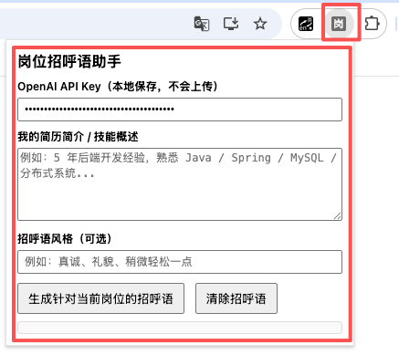

## 岗位招呼语助手（Chrome 扩展）

这个扩展可以在你浏览招聘网站职位详情页时：

- 自动抓取当前页面上的岗位描述文本
- 将其与你预先填好的简历简介 / 技能概述进行匹配
- 调用 OpenAI 接口，为该岗位生成一段个性化的中文求职招呼语

### 文件结构

- `manifest.json`：Chrome 扩展配置（Manifest V3）
- `content.js`：注入到网页中，负责提取岗位描述
- `popup.html`：扩展弹窗界面
- `popup.js`：弹窗逻辑，调用 OpenAI 接口生成招呼语

### 使用步骤

1. 在项目根目录（本文件所在目录）下，准备好以下文件：
   - `manifest.json`
   - `content.js`
   - `popup.html`
   - `popup.js`

2. 打开 Chrome，输入 `chrome://extensions/`。
3. 右上角开启「开发者模式」。
4. 点击「加载已解压的扩展程序」，选择本项目所在目录。
5. 加载成功后，浏览器工具栏会出现图标（默认是一个占位图标）。

### 首次配置

1. 点击工具栏中的扩展图标，打开弹窗。
2. 在「OpenAI API Key」输入框中填入你的 Key（例如 `sk-xxx`），该信息仅保存在浏览器本地 `chrome.storage.sync` 中，不会上传到其他地方。
3. 在「我的简历简介 / 技能概述」中，粘贴你简历的精简版，比如：

   - 工作年限、岗位（如「5 年后端开发经验」）
   - 核心技术栈（如「Java / Spring / MySQL / Redis / Kafka」）
   - 典型项目或业务领域（如「广告投放系统」「电商订单系统」）

4. （可选）在「招呼语风格」中填写风格偏好，比如「真诚、礼貌、稍微轻松一点」。

### 使用方式

1. 打开任意招聘网站的**职位详情页**。
2. 点击浏览器工具栏的扩展图标。
3. 点击「生成针对当前岗位的招呼语」按钮：
   - 扩展会在当前页面中自动查找岗位描述区域；
   - 如果找不到，会退化为抓取页面主要文本。
4. 等待几秒后，你会在弹窗中看到生成好的中文招呼语，可以复制后用于：
   - 站内私信 HR / 招聘者
   - 微信 / 邮件主动联系

### 注意事项

- **隐私**：你的 API Key、简历简介都只保存在本地浏览器的存储里，代码中没有任何上传到第三方服务器的逻辑，只有直接调用 [魔搭社区](https://www.modelscope.cn/my/overview) 官方 API。
- 不同招聘网站的页面结构不完全一致。如果某个网站岗位描述没有被正确识别，可以调整 `content.js` 中的选择器列表，增加该网站特有的选择器。

